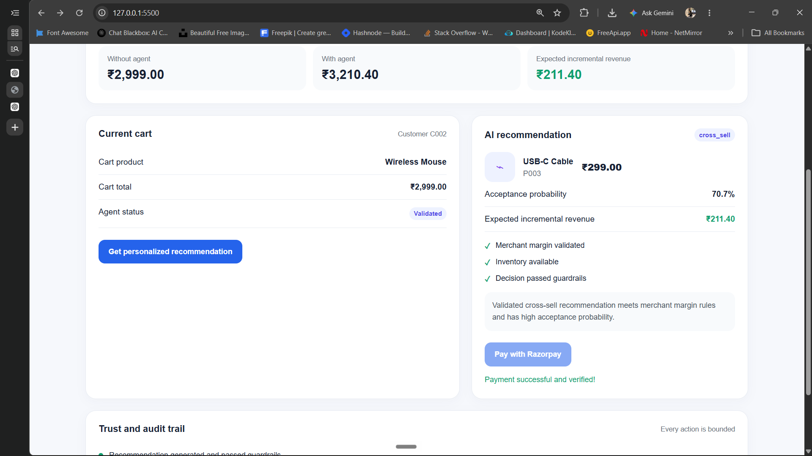
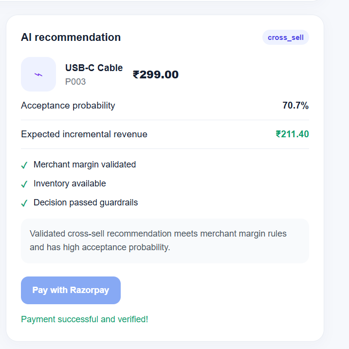

# Razorpay Revenue Agent

An AI-powered revenue optimization prototype that recommends relevant products to customers while following merchant business rules.

The system estimates potential revenue uplift and allows the customer to complete the purchase using Razorpay Test Mode.

---

## Demo

### Main Dashboard



### AI Recommendation



### Razorpay Checkout


### Payment Verification


> Add your screenshots inside the `screenshots` folder using the filenames above.

---

## Problem

Online merchants often lose additional revenue because they do not know which product to recommend to a customer.

A recommendation should not only be relevant. It must also follow merchant rules such as:

- Minimum profit margin
- Product availability
- Allowed recommendation types
- Maximum discount or incentive

---

## Solution

This prototype combines:

1. **ML recommendation engine**  
   Predicts which product a customer is likely to accept.

2. **Deterministic decision engine**  
   Checks margin, inventory, and merchant rules.

3. **Gemini AI agent**  
   Selects and explains the recommendation using available tools.

4. **Razorpay Test Mode**  
   Creates and verifies the final payment order.

5. **Audit logging**  
   Stores the recommendation, rules, decision, and validation result.

---

## Example

For the demo customer:

| Metric | Value |
|---|---:|
| Original cart total | ₹2,999 |
| Recommended product | USB-C Cable |
| Recommendation price | ₹299 |
| Acceptance probability | 70.7% |
| Expected incremental revenue | ₹211.40 |
| Expected revenue lift | 7.05% |
| Actual checkout total | ₹3,298 |

The expected revenue uses the acceptance probability:

```text
Expected incremental revenue
= Product price × Acceptance probability
= ₹299 × 0.707
≈ ₹211.40

Architecture
Customer Cart
     ↓
ML Recommendation Engine
     ↓
Gemini AI Agent
     ↓
Merchant Rules + Deterministic Validator
     ↓
Validated Recommendation
     ↓
Revenue Experiment
     ↓
Razorpay Checkout
     ↓
Payment Verification + Audit Log

Tech Stack

Python

FastAPI

Gemini API

Pandas

Scikit-learn / Joblib

Razorpay Test Mode

HTML, CSS, JavaScript

Pytest

Setup
1. Clone the repository 
git clone <your-github-repository-url>
cd razorpay-revenue-agent

2. Install dependencies
pip install -r requirements.txt

3. Create the environment file
Create a .env file in the project root:
GEMINI_API_KEY=your_gemini_api_key
RAZORPAY_KEY_ID=your_razorpay_test_key_id
RAZORPAY_KEY_SECRET=your_razorpay_test_key_secret

4. Start the backend
uvicorn backend.api:app --reload

5. Start the frontend
Open another terminal and run:
python -m http.server 5500 --directory frontend

Open: http://127.0.0.1:5500/


Important Note

This is a prototype using a controlled demo dataset and Razorpay Test Mode.

The AI agent proposes a recommendation, but the final decision is validated by deterministic Python rules. The AI cannot bypass merchant constraints.